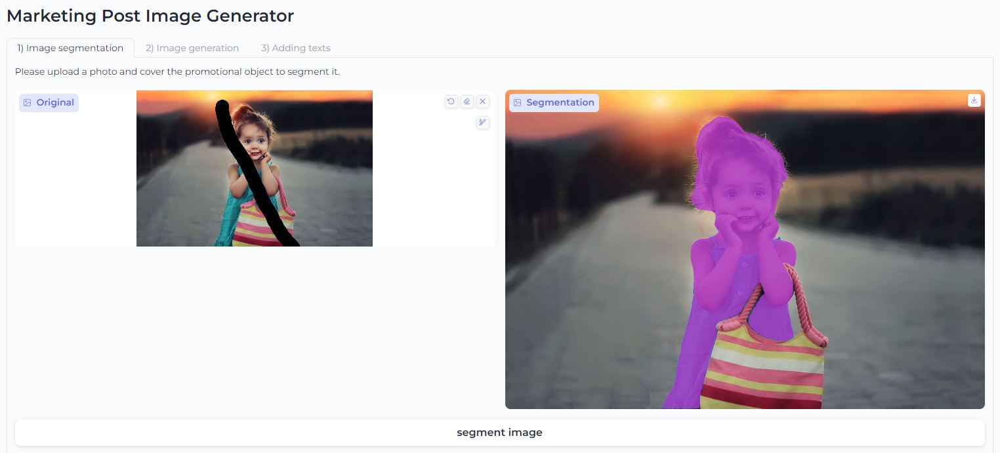
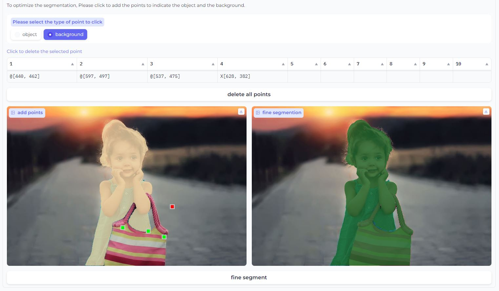
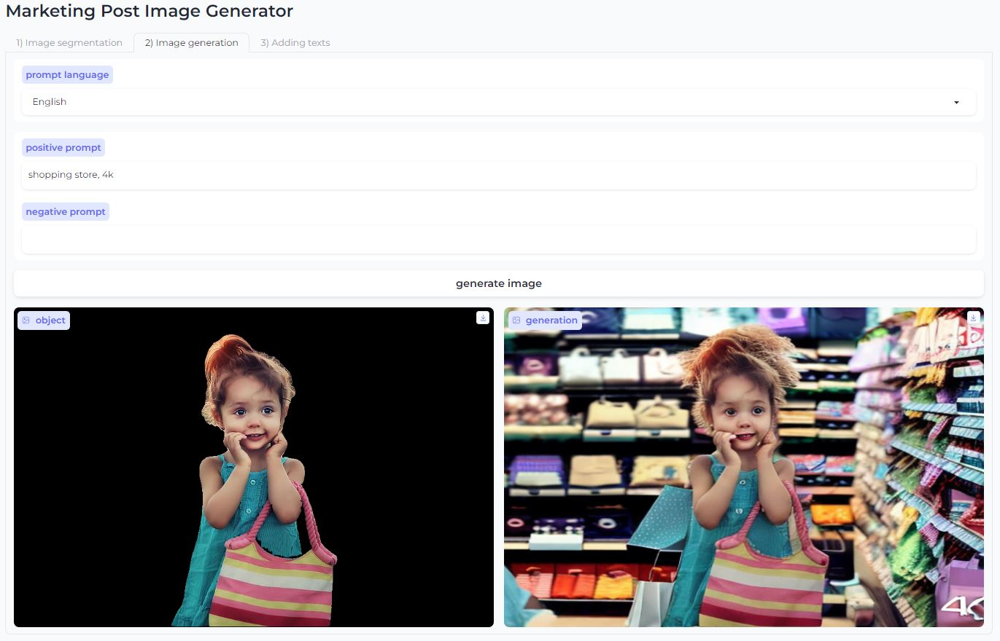
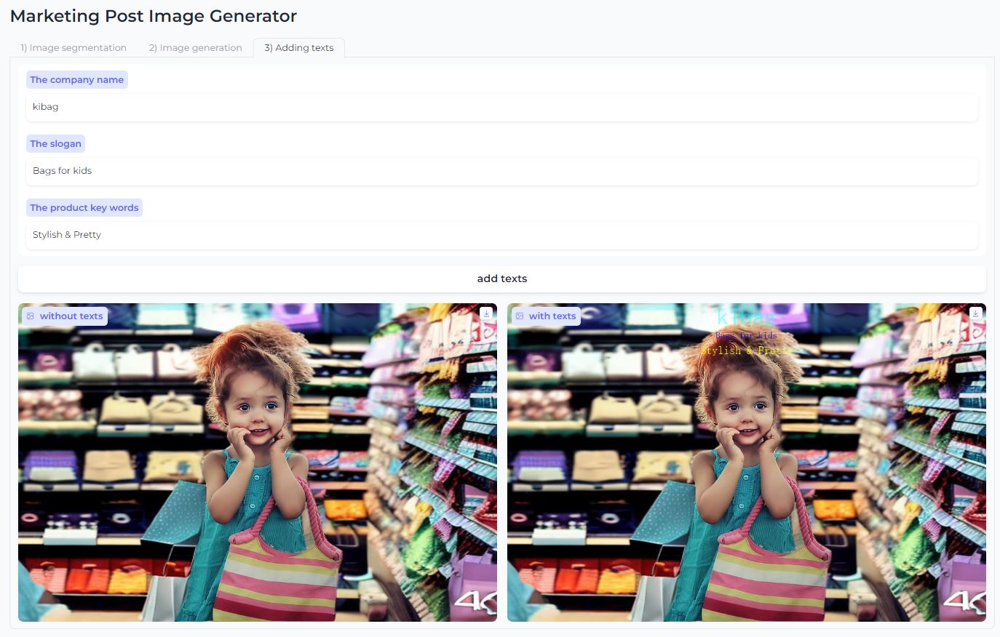

# Marketing_Post_Image_Generator
This web app will help user to generate background around the user uploaded promotional object and add texts into the generated image.
The post image is generated in 3 steps.

    1. Upload an image containing a promotional object;
        segement the promotional object by covering it;
        The segmentation can be further improved by selecting points (in the object and in the background).
    2. Generate a image by giving the positive and negative prompts.
    3. Add texts of the company name, the slogan and the key words of the promotioanl object.

The generator use the facebook segment anything model to infer the segmentation task; Use stable diffusion 2--inpainting to generator the background image; Use grids like the rule of thirds to find where to add texts in the generated image.

## Tab image segmentation:

## Tab image generation:

## Tab adding text:

Note: 

  The prompt for image generation supports English and Chinese. To support more languages, just change the dropdown function in the web interface, eg "src_language = gr.Dropdown(choices=lang_codes, default='English', label='Prompt language')".
  
  For adding text in the image, the code can only display English and Chinese correctly. To support more languages, we need to install more fonts and modify the fonts used in the "addText" function.
